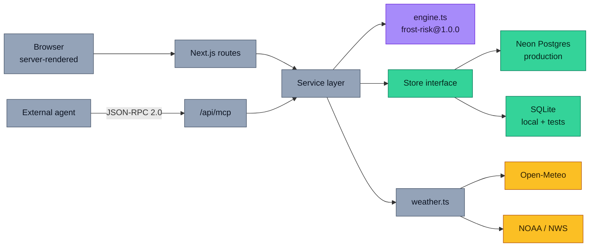
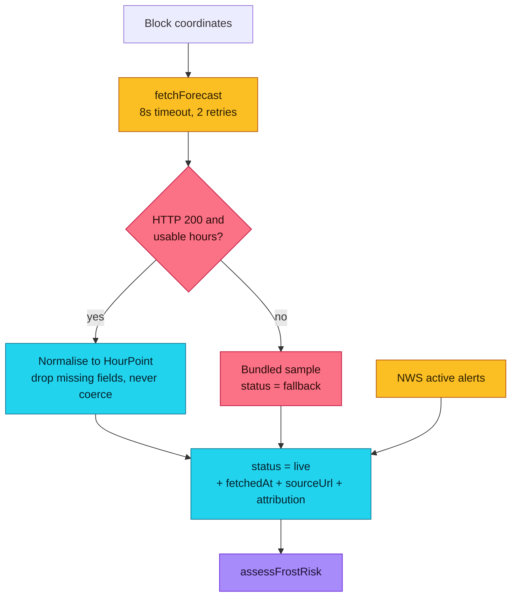
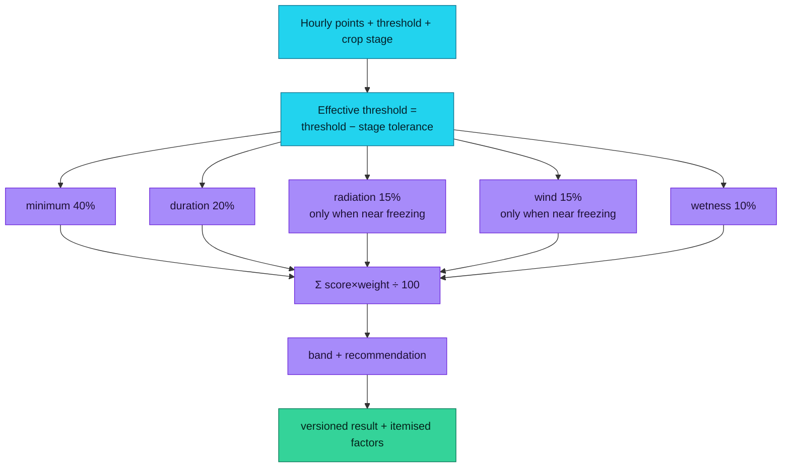
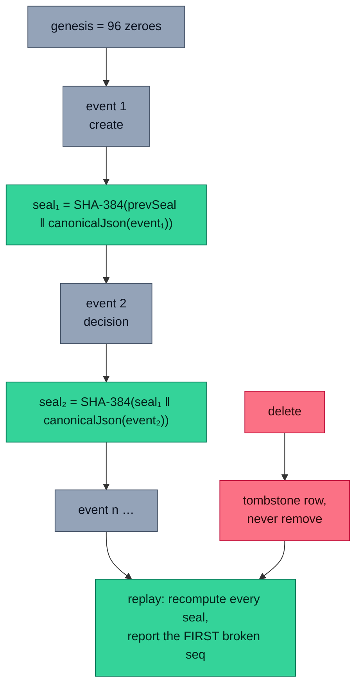
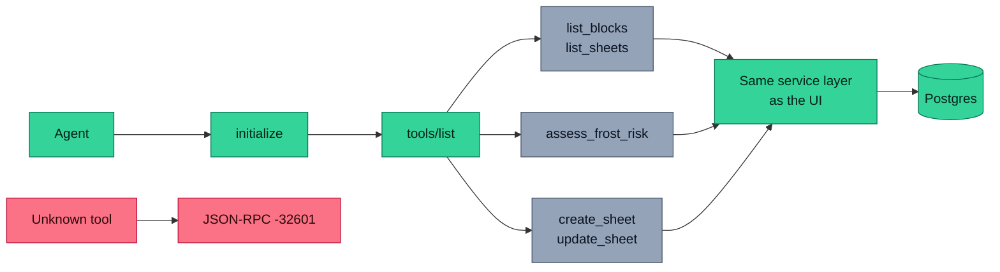
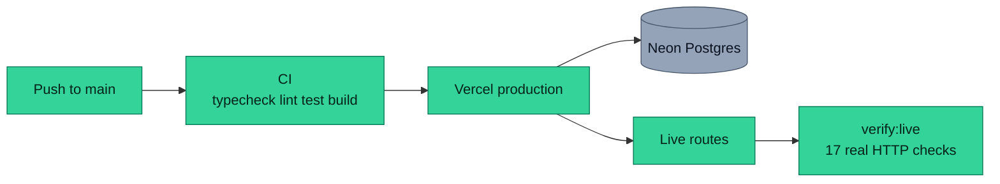
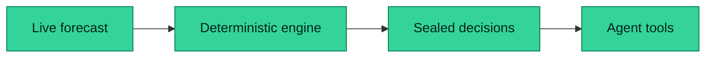
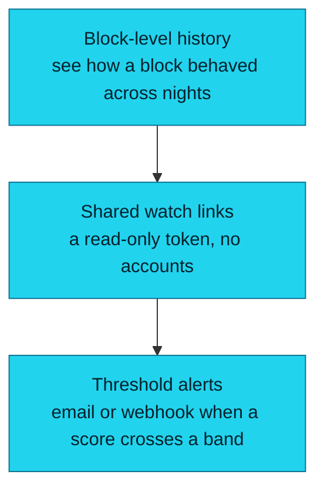
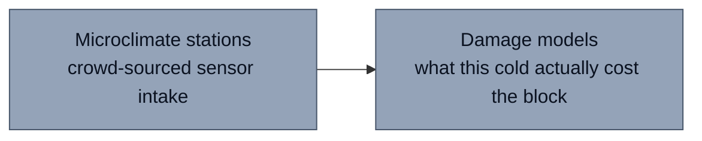

<div align="center">

# Frostwatch

### Know whether to start the wind machines — before dawn, not after.

[](https://frostwatch.vercel.app)
[](LICENSE)
[](https://nextjs.org)
[](tsconfig.json)
[](https://neon.tech)
[](https://open-meteo.com)
[](public/mcp.json)

[Live App](https://frostwatch.vercel.app) · [GitHub](https://github.com/aniruddhaadak80/frostwatch) ·
[API health](https://frostwatch.vercel.app/api/health) · [Agent](https://frostwatch.vercel.app/agent) ·
[Issues](https://github.com/aniruddhaadak80/frostwatch/issues)

</div>

---

A grower does not need to be told the forecast. They need to know whether tonight's cold will
damage the block, when to start the fans, and — six weeks later — whether that decision is still
the one they made.

Frostwatch pulls the **real** overnight forecast for a real block, scores frost risk with a
deterministic engine you can disagree with one factor at a time, records the decision, and seals
it into a hash chain that still replays months later.

> **This is automated guidance from a public forecast, not an agronomic recommendation.** Confirm
> with your own field sensors and local extension advice before acting.

## ✨ Features

| Outcome you get | How |
| --- | --- |
| Know whether tonight is a frost night | `POST /api/engine` returns a 0–100 score, a band and `run-protection` / `stand-by` / `no-action` |
| See *why*, not just a number | Five itemised factors with weight, observed value, contribution and a plain-English rationale |
| Know when to start the fans | Cold windows are computed from the hourly trace, with exact start and end hours |
| Defend a decision later | Every sheet keeps a SHA-384 chain; `replay_sheet` reports the first broken link |
| Hand the work to an agent | Six MCP tools over JSON-RPC 2.0, including two mutating ones that share the UI's code path |
| Take something with you | A markdown frost brief with provenance timestamps and the chain head |

## 🚀 Quickstart

Requires Node 20+.

```bash
git clone https://github.com/aniruddhaadak80/frostwatch.git
cd frostwatch
npm install
npm run dev
```

Open <http://localhost:3000>. **No environment variables are needed.** Local runs use an embedded
SQLite database at `.data/frostwatch.db`, created and seeded on first use.

Production needs exactly one variable:

| Variable | Required | Meaning |
| --- | --- | --- |
| `DATABASE_URL` | production only | Hosted Postgres (Neon) connection string. Without it a production build **refuses to start** rather than writing to an ephemeral store. |
| `SQLITE_PATH` | no | Override the local SQLite file path. Defaults to `.data/frostwatch.db`. |

```bash
npm run typecheck && npm run lint && npm run test && npm run build
npm run verify:live    # real HTTP checks against the deployment
```

## 📐 Architecture



One engine, three callers. The browser, `/api/engine` and the `assess_frost_risk` MCP tool all
call `assessFrostRisk` from `src/lib/engine.ts`. There is no second implementation of the score.

## 🔌 Data pipeline and honest fallback



A missing `cloud_cover` is **dropped, not coerced to zero**, because "unknown cloud" read as
"clear sky" would fabricate frost risk. A fallback response is always labelled `status:
"fallback"` and carries a `note` explaining why, and a fallback can never overwrite a record a
person created.

## 🧮 The deterministic engine



Fixed integer weights summing to 100, so the score reads as a percentage and the combine step
cannot drift between platforms. Radiation and wind are *modifiers* of frost rather than sources
of it, so they only score once the night is within 3 °C of freezing — otherwise a clear, still
summer evening would report frost risk.

Crop stages differ in how much cold they absorb: flowering and fruit-set are stressed 0.5 °C
below their stated threshold, veraison 2 °C.

## 🛡️ Integrity: seals and replay



`canonicalJson` sorts object keys recursively so the same event always serialises to the same
bytes — otherwise adding a field could change a hash for reasons unrelated to the event's meaning.
Retiring a sheet writes a tombstone rather than deleting the row, so the chain still replays after
a removal. Replay reports the first broken sequence number, and whether the sheet's stored seal
still equals its recomputed head.

## 🤖 Agent interface



Configuration is published at [`public/mcp.json`](public/mcp.json):

```json
{
  "mcpServers": {
    "frostwatch": {
      "type": "http",
      "url": "https://frostwatch.vercel.app/api/mcp",
      "transport": "jsonrpc-2.0"
    }
  }
}
```

| Tool | Kind | Notes |
| --- | --- | --- |
| `list_blocks` | read | Real coordinates, crop stage, thresholds |
| `list_sheets` | read | Scoped to the caller's session |
| `assess_frost_risk` | analysis | Live forecast scored by the engine |
| `create_sheet` | mutating | **Idempotent** on (block, night) |
| `update_sheet` | mutating | Extends the audit chain |
| `replay_sheet` | read | Recomputes the chain |

## 🔌 API

```bash
# Health, including the real store probe
curl -s https://frostwatch.vercel.app/api/health

# Live forecast + engine verdict for a real block
curl -s "https://frostwatch.vercel.app/api/forecast?block=blk-yakima"

# The engine on its own
curl -s -X POST https://frostwatch.vercel.app/api/engine \
  -H 'content-type: application/json' \
  -d '{"blockId":"blk-willamette"}'
```

A full mutation with read-back:

```bash
BASE=https://frostwatch.vercel.app

# 1. create (the session cookie is what scopes ownership)
curl -s -c jar -b jar -X POST $BASE/api/sheets \
  -H 'content-type: application/json' \
  -d '{"blockId":"blk-yakima","nightOf":"2026-01-15","notes":"watching"}'

# 2. read back
curl -s -c jar -b jar $BASE/api/sheets/sh_xxxxxxxxxxxxxxxx

# 3. record a decision
curl -s -c jar -b jar -X PATCH $BASE/api/sheets/sh_xxxxxxxxxxxxxxxx \
  -H 'content-type: application/json' \
  -d '{"status":"protected","actor":"grower"}'

# 4. replay the audit chain
curl -s -c jar -b jar $BASE/api/integrity/sh_xxxxxxxxxxxxxxxx

# 5. export the brief
curl -s -c jar -b jar "$BASE/api/export?sheet=sh_xxxxxxxxxxxxxxxx" -o brief.md

# 6. retire (tombstone; the chain still replays)
curl -s -c jar -b jar -X DELETE $BASE/api/sheets/sh_xxxxxxxxxxxxxxxx
```

Errors always look the same, so callers can branch on `error.code`:

```json
{ "error": { "code": "SHEET_EXISTS", "message": "a sheet already exists for this block and night" } }
```

| Status | Code | Meaning |
| --- | --- | --- |
| 400 | `VALIDATION_FAILED`, `BAD_JSON` | Body did not match the schema |
| 403 | — | never returned; another owner's sheet is a 404 |
| 404 | `SHEET_NOT_FOUND`, `BLOCK_UNKNOWN` | Not yours, or never existed |
| 409 | `SHEET_EXISTS`, `SHEET_RETIRED` | Conflict |
| 422 | `BLOCK_UNKNOWN` | Declaration failed validation |
| 503 | `STORE_UNAVAILABLE` | Production store unreachable |

## 👤 User journey

```mermaid
graph LR
  Land["Land on /<br/>live scores"] --> Pick["Pick a block"]
  Pick --> Lab["/effort<br/>drag the threshold lamp"]
  Lab --> Rec["Record on a real sheet"]
  Rec --> Sheet["/sheets/id<br/>record the decision"]
  Sheet --> Verify["Replay the chain"]
  Verify --> Brief["/export<br/>download the brief"]
  Brief --> Agent["/agent<br/>same tools, JSON-RPC"]
  classDef ok fill:#34d399,color:#04231a,stroke:#047857
  classDef data fill:#22d3ee,color:#04212b,stroke:#0e7490
  class Land,Lab,Rec data
  class Sheet,Verify,Brief,Agent ok
```



## 📁 Project map

| Route | Goal |
| --- | --- |
| `/` | Live state for the first three blocks, scored on every load |
| `/sheets` | Workspace: create a sheet, list yours, see seals |
| `/sheets/[id]` | Dynamic detail: engine verdict, provenance, decision controls, audit trail |
| `/effort` | Analysis: the threshold lamp, a draggable verdict over the hourly trace |
| `/agent` | Agent console: six real JSON-RPC calls with raw responses |
| `/export` | Takeaway: sealed markdown briefs and chain status |

| API route | Method | Purpose |
| --- | --- | --- |
| `/api/health` | GET | Real store probe |
| `/api/forecast` | GET | Live or labelled-fallback forecast + verdict |
| `/api/sheets` | GET, POST | List and create |
| `/api/sheets/[id]` | GET, PATCH, DELETE | Read, decide, retire |
| `/api/engine` | POST | Engine only |
| `/api/integrity/[id]` | GET | Replay the chain |
| `/api/export` | GET | Markdown brief download |
| `/api/mcp` | POST | JSON-RPC 2.0: `initialize`, `tools/list`, `tools/call` |

| Module | Responsibility |
| --- | --- |
| `src/lib/engine.ts` | The deterministic engine. Pure, versioned, itemised |
| `src/lib/integrity.ts` | Canonical JSON, SHA-384 chain, replay |
| `src/lib/store.ts` | Repository interface and adapter selection |
| `src/lib/store-sqlite.ts` | Embedded adapter, local and tests |
| `src/lib/store-neon.ts` | Hosted Postgres adapter |
| `src/lib/weather.ts` | Fetching, normalisation, honest fallback |
| `src/lib/session.ts` | Anonymous owner id |
| `src/proxy.ts` | Issues the owner cookie before render |

## 🔐 Security and reliability

- No accounts. Ownership is a 128-bit id in an HTTP-only cookie, issued in `src/proxy.ts`.
  A sheet belonging to another session returns **404, not 403**, so ids cannot be probed.
- Every input is validated with zod and bounded. Queries are parameterised; no SQL is built by
  string concatenation.
- External calls are allowlisted to `api.open-meteo.com` and `api.weather.gov`, 8-second
  timeouts, two bounded retries.
- A production build without `DATABASE_URL` throws instead of degrading to an ephemeral store.
- Per-session rate limiting is **best-effort** on serverless: clearing the cookie yields a new
  identity. Put a hosted limiter in front of `/api/sheets` and `/api/mcp` for write-heavy use.
  See [SECURITY.md](SECURITY.md).

## 🚀 Deployment

Vercel with the Neon integration attached. `DATABASE_URL` is injected by the integration; nothing
is committed. The deploy pipeline is: `npm ci` → `typecheck` → `lint` → `test` → `build`, then the
Node runtime serves the same engine.



## 🗺️ Roadmap

**Now** — shipped and verified:



- [x] Live Open-Meteo + NWS data with an honest `live`/`fallback` label
- [x] Deterministic, versioned, itemised frost-risk engine
- [x] Append-only SHA-384 audit chain with replay
- [x] Six MCP tools, two of them mutating, idempotent on create

**Next** — user-visible outcomes:



- [ ] Compare a block across nights so a grower can see whether tonight is unusual
- [ ] Read-only share links, so a grower can hand a decision to an agronomist without an account
- [ ] Threshold alerts when the score crosses a band, via webhook

**Later** — outcomes, not features for their own sake:



- [ ] Accept readings from grower-installed sensors to sharpen the trace
- [ ] Optional chilling-injury models per variety, clearly labelled as advisory

## 📊 Data attribution

| Source | Use | Licence |
| --- | --- | --- |
| [Open-Meteo](https://open-meteo.com) | Hourly forecast | CC BY 4.0 |
| [NOAA / NWS api.weather.gov](https://www.weather.gov/documentation/services-web-api) | Active alerts | Public domain |

Both are public and need no API key. Every forecast response carries its fetch time, source URL
and licence.

## 🤝 Contributing

See [CONTRIBUTING.md](CONTRIBUTING.md). The four rules that matter: one engine, append-only
integrity, honest provenance, and never a silent production fallback.

## 📄 License

MIT — see [LICENSE](LICENSE).
